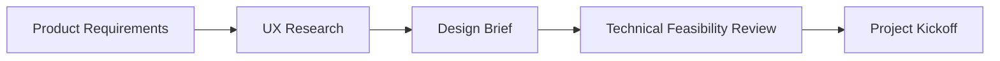

# Design-Development Collaboration Guide

## 🎨 Overview

This document outlines the collaboration framework between UX/UI design teams and development teams to ensure seamless user experience and interface implementation.

## 🤝 Collaboration Principles

### Core Values
- **User-Centered Design**: All decisions prioritize user experience
- **Design Consistency**: Maintain coherent visual and interaction patterns
- **Technical Feasibility**: Balance design aspirations with technical constraints
- **Iterative Improvement**: Continuous feedback and refinement
- **Transparent Communication**: Open dialogue between teams

### Success Metrics
- Design-to-development handoff efficiency
- UI consistency scores
- User satisfaction ratings
- Time-to-market for new features
- Design system adoption rate

## 🔄 Collaboration Workflow

### 1. Project Initiation


**Participants**: Product Manager, UX Designer, UI Designer, Tech Lead, Frontend Developer

**Deliverables**:
- Design brief with user personas and requirements
- Technical constraints and feasibility assessment
- Timeline and milestone alignment
- Success criteria definition

### 2. Design Phase

#### UX Design
- **User Research & Analysis**
  - User interviews and surveys
  - Competitive analysis
  - User journey mapping
  - Information architecture
  
- **Wireframing & Prototyping**
  - Low-fidelity wireframes
  - Interactive prototypes
  - User flow documentation
  - Accessibility considerations

#### UI Design
- **Visual Design**
  - High-fidelity mockups
  - Component specifications
  - Style guide adherence
  - Responsive breakpoint designs

- **Design System Updates**
  - New component creation
  - Existing component modifications
  - Pattern library updates
  - Token value adjustments

### 3. Design Review & Validation

#### Design Review Sessions
- **Weekly Design Reviews**
  - Cross-functional team attendance
  - Design iteration presentations
  - Technical feasibility discussions
  - User feedback integration

- **Stakeholder Reviews**
  - Product owner approval
  - Business stakeholder sign-off
  - Legal/compliance validation
  - Brand guideline compliance

#### User Testing
- **Prototype Testing**
  - Usability testing sessions
  - A/B testing preparation
  - Accessibility testing
  - Performance impact assessment

### 4. Design Handoff

#### Design Specifications
- **Figma/Design Tool Handoff**
  - Pixel-perfect specifications
  - Component states and variations
  - Interaction animations
  - Asset exports (SVG, PNG, etc.)

- **Documentation**
  - Design rationale and decisions
  - User interaction guidelines
  - Accessibility requirements
  - Performance considerations

#### Technical Implementation Planning
- **Development Estimation**
  - Story point estimation
  - Technical complexity assessment
  - Dependency identification
  - Timeline estimation

- **Implementation Strategy**
  - Component breakdown
  - Development approach
  - Testing strategy
  - Rollout plan

### 5. Development Phase

#### Implementation Collaboration
- **Daily Standups**
  - Progress updates
  - Blocker identification
  - Design clarifications
  - Timeline adjustments

- **Implementation Reviews**
  - Design fidelity validation
  - Responsive behavior verification
  - Accessibility compliance check
  - Performance optimization

#### Quality Assurance
- **Design QA Process**
  - Pixel-perfect comparison
  - Cross-browser testing
  - Device compatibility testing
  - Accessibility audit

- **User Acceptance Testing**
  - Stakeholder review
  - User testing validation
  - Performance benchmarking
  - Accessibility compliance

## 🛠️ Tools & Processes

### Design Tools
- **Primary Design Tool**: Figma
- **Prototyping**: Figma, Framer
- **User Research**: Miro, Hotjar, UserTesting
- **Collaboration**: Slack, Notion

### Development Tools
- **Design Tokens**: Style Dictionary
- **Component Library**: Storybook
- **Version Control**: Git
- **CI/CD**: GitHub Actions

### Handoff Tools
- **Design Specs**: Figma Dev Mode
- **Asset Management**: Figma, IconJar
- **Documentation**: Notion, Confluence
- **Communication**: Slack, Linear

## 📋 Design System Governance

### Component Library Management
```typescript
// Component Documentation Template
interface ComponentSpec {
  name: string;
  description: string;
  variants: ComponentVariant[];
  states: ComponentState[];
  accessibility: AccessibilitySpec;
  usage: UsageGuidelines;
  designTokens: DesignTokens;
  examples: CodeExample[];
}
```

### Design Token Structure
```json
{
  "color": {
    "primary": {
      "50": "#f0f9ff",
      "500": "#3b82f6",
      "900": "#1e3a8a"
    }
  },
  "spacing": {
    "xs": "4px",
    "sm": "8px",
    "md": "16px"
  },
  "typography": {
    "heading-1": {
      "fontSize": "32px",
      "lineHeight": "40px",
      "fontWeight": "bold"
    }
  }
}
```

### Component Review Process
1. **Design Proposal**
   - New component identification
   - Use case documentation
   - Design specifications

2. **Technical Review**
   - Implementation feasibility
   - Performance impact
   - Accessibility compliance

3. **Design System Integration**
   - Token alignment
   - Pattern consistency
   - Documentation updates

4. **Implementation & Testing**
   - Component development
   - Visual regression testing
   - Accessibility testing

## 🔍 Quality Assurance Framework

### Design Fidelity Checklist
- [ ] **Visual Accuracy**
  - [ ] Colors match design tokens
  - [ ] Typography specifications implemented
  - [ ] Spacing and layout precise
  - [ ] Component states accurate

- [ ] **Responsive Design**
  - [ ] Mobile-first implementation
  - [ ] Breakpoint behavior correct
  - [ ] Touch target sizes appropriate
  - [ ] Content reflow optimized

- [ ] **Interactions & Animations**
  - [ ] Hover states implemented
  - [ ] Loading states functional
  - [ ] Transitions smooth and performant
  - [ ] Error states handled

- [ ] **Accessibility**
  - [ ] WCAG 2.1 AA compliance
  - [ ] Screen reader compatibility
  - [ ] Keyboard navigation support
  - [ ] Color contrast validated

### Performance Considerations
- **Image Optimization**
  - WebP format support
  - Lazy loading implementation
  - Responsive image sizing
  - CDN optimization

- **Code Splitting**
  - Component-level splitting
  - Route-based splitting
  - Dynamic imports
  - Bundle size monitoring

## 📈 Success Metrics & KPIs

### Design Quality Metrics
- **Design System Adoption**: 95% component usage
- **Design Consistency Score**: >90% across pages
- **Accessibility Compliance**: 100% WCAG 2.1 AA
- **Performance Score**: >90 Lighthouse score

### Collaboration Metrics
- **Handoff Efficiency**: <2 days from design to dev
- **Design Changes**: <10% post-handoff revisions
- **Review Cycle Time**: <3 days for design reviews
- **Implementation Accuracy**: >95% design fidelity

### User Experience Metrics
- **User Satisfaction**: >4.5/5 rating
- **Task Completion Rate**: >90%
- **Time to Complete**: <20% improvement
- **Error Rate**: <2% user errors

## 🚀 Best Practices

### For Designers
1. **Design with Development in Mind**
   - Use established design system components
   - Consider technical constraints early
   - Provide multiple device specifications
   - Document interaction details

2. **Collaborate Early and Often**
   - Include developers in design reviews
   - Seek technical feedback on concepts
   - Test prototypes with real data
   - Validate assumptions with users

3. **Maintain Design System**
   - Keep component library updated
   - Document design decisions
   - Ensure token consistency
   - Monitor implementation accuracy

### For Developers
1. **Understand Design Intent**
   - Review design rationale
   - Ask clarifying questions
   - Attend design presentations
   - Test user interactions

2. **Maintain Design Fidelity**
   - Follow specifications precisely
   - Test across devices and browsers
   - Validate accessibility compliance
   - Optimize for performance

3. **Provide Technical Feedback**
   - Communicate constraints early
   - Suggest technical alternatives
   - Share implementation insights
   - Collaborate on solutions

## 📚 Resources & Training

### Design Resources
- [Design System Documentation]
- [Figma Component Library]
- [Brand Guidelines]
- [Accessibility Standards]

### Development Resources
- [Component Storybook]
- [Design Token Documentation]
- [Implementation Guidelines]
- [Testing Procedures]

### Training Programs
- **Monthly Design-Dev Workshops**
- **Accessibility Training Sessions**
- **Tool Proficiency Courses**
- **Cross-Functional Shadowing**

## 🔄 Continuous Improvement

### Regular Reviews
- **Monthly Retrospectives**
  - Process effectiveness review
  - Tool evaluation
  - Workflow optimization
  - Success metric analysis

- **Quarterly Planning**
  - Goal setting and alignment
  - Resource allocation
  - Tool updates and training
  - Process refinements

### Feedback Loops
- **User Research Integration**
- **Performance Monitoring**
- **Accessibility Audits**
- **Design System Evolution**

---

*This document is living and should be updated regularly based on team feedback and process improvements.*
